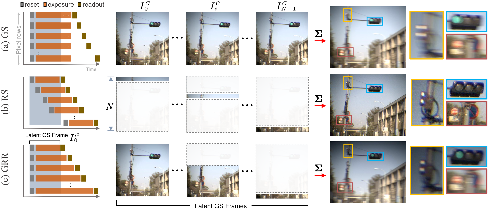

## Single Image Deblurring with Row-dependent Blur Magnitude
  [Paper](https://openaccess.thecvf.com/content/ICCV2023/papers/Ji_Single_Image_Deblurring_with_Row-dependent_Blur_Magnitude_ICCV_2023_paper.pdf) | [Supp](https://openaccess.thecvf.com/content/ICCV2023/supplemental/Ji_Single_Image_Deblurring_ICCV_2023_supplemental.pdf) | [Dataset](https://drive.google.com/file/d/1l0GMiv2xMcVaSuIY4E7f3zPljtRq1mju/view?usp=drive_link)

Xiang Ji<sup>1</sup>, Zhixiang Wang<sup>1,2</sup>, Shin'ichi Satoh<sup>2,1</sup>, Yinqiang Zheng<sup>1</sup>

<sup>1</sup>The University of Tokyo&nbsp;&nbsp;<sup>2</sup>National Institute of Informatics&nbsp;&nbsp;


This repository provides the official PyTorch implementation of the paper.

#### TL;DR
This paper explores a novel in-between exposure mode called global reset release (GRR) shutter, which produces GS-like blur but with row-dependent blur magnitude. We take advantage of this unique characteristic of GRR to explore the latent frames within a single image and restore a clear counterpart by relying only on these latent contexts.



## Dependencies
1. Python and Pytorch
- Pyhotn=3.8 (Anaconda recommended)
- Pytorch=1.11.0
- CUDA=11.3/11.4
``` shell
conda create -n rsst python=3.8
conda activate rsst
conda install pytorch==1.11.0 torchvision==0.12.0 torchaudio==0.11.0 cudatoolkit=11.3 -c pytorch
```
2. Other packages
``` shell
pip install -r requirements.txt
```

## Data and Pretrained Model
- Download datasets [GRR_real](https://drive.google.com/file/d/1l0GMiv2xMcVaSuIY4E7f3zPljtRq1mju/view?usp=drive_link) and [RSGR-GS_v1](https://drive.google.com/file/d/1gkZpdtDPMGyQF6t-GVq6YgjQ3QfknVRv/view).
- Unzip them under a specified directory by yourself.
- The dataset folder structure should be like the format below (Minor adjustments to the folder structure of RSGR-GS_v1 may be needed.):
```
GRR_real
├─ train
│ ├─ seq1    % 50 sequences
│ │ ├─ GS
| | | ├─ PNG
| | | | ├─xxxx.png
| | | | ├─......
| | | ├─ RAW (same as PNG)
| | | | ├─ ......
│ │ ├─ RSGR (same as GS)
| | | ├─ ......
│ │
│─ validate  %  7 sequences
│ ├─ ...... (same as train)
│
├─ test    % 7 sequences
│ ├─ ...... (same as train)
```
- Please download checkpoints from this [link](https://drive.google.com/drive/folders/1vH4VTys36bcJLKuu22GKz3RR3bFTd5fb?usp=sharing) and put them under root directory of this project.

## Test
To test RSS-T, please run the command below:
``` shell
bash ./test.sh       ### Please specify your data directory and output path in the script
```
## Train
To train RSS-T, please run the command below:
``` shell
bash ./train.sh       ### Please refer to the script for more info.
```

## Citation

If you find our work useful, please kindly cite as:
```
@InProceedings{Ji_2023_ICCV,
    author    = {Ji, Xiang and Wang, Zhixiang and Satoh, Shin'ichi and Zheng, Yinqiang},
    title     = {Single Image Deblurring with Row-dependent Blur Magnitude},
    booktitle = {Proceedings of the IEEE/CVF International Conference on Computer Vision (ICCV)},
    month     = {October},
    year      = {2023},
    pages     = {12269-12280}
}
```

## Acknowledgement
This project is based on public works below:

- [neural-global-shutter](https://github.com/lightChaserX/neural-global-shutter)
- [MIMO-UNet](https://github.com/chosj95/MIMO-UNet)
- [Uformer](https://github.com/ZhendongWang6/Uformer)
- [DeepDeblur_release](https://github.com/SeungjunNah/DeepDeblur_release)
